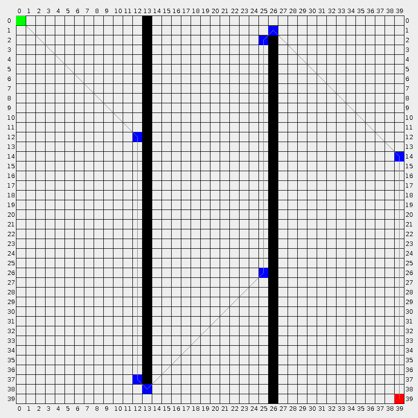

# A*

___A fast, GC-free Java implementation of A* (A Star) algorithm.___

[![Maven Release][maven-shield]][maven-link]
[![Javadocs][javadoc-shield]][javadoc-link]

## Usage

```java
// Build a grid map of 20 * 20
Grid grid = new Grid(20, 20);

// By default, all the points in the grid map are walkable
grid.setWalkable(5, 5, false);

// Get a AStar object
AStar aStar = new AStar();
// AStar aStar = ThreadLocalAStar.current();

// Search
Path path = aStar.search(0, 0, grid.getWidth() - 1, grid.getHeight() - 1, grid);

// Output
for (int i = 0; i < path.size(); i++) {
  long p = path.get(i);
  int x = Point.getX(p);
  int y = Point.getY(p);
  System.out.println(x + "-" + y);
}
```

## Benchmark

CPU: Intel(R) Core(TM) i7-7600U CPU @ 2.80GHz

```
From 0-0 to 99-99 -> 56180 ops/sec
From 0-0 to 99-99 -> 87566 ops/sec
From 0-0 to 99-99 -> 87489 ops/sec

From 0-0 to 199-199 -> 36271 ops/sec
From 0-0 to 199-199 -> 36510 ops/sec
From 0-0 to 199-199 -> 36430 ops/sec

From 0-0 to 299-299 -> 23392 ops/sec
From 0-0 to 299-299 -> 23310 ops/sec
From 0-0 to 299-299 -> 23095 ops/sec

From 0-0 to 399-399 -> 16121 ops/sec
From 0-0 to 399-399 -> 16088 ops/sec
From 0-0 to 399-399 -> 16059 ops/sec

From 0-0 to 499-499 -> 12045 ops/sec
From 0-0 to 499-499 -> 12011 ops/sec
From 0-0 to 499-499 -> 11867 ops/sec
```

## Screenshots



<!-- references -->

[maven-shield]: https://img.shields.io/maven-central/v/io.ytcode/pathfinding.png
[maven-link]: https://search.maven.org/search?q=io.ytcode.pathfinding
[javadoc-shield]: https://www.javadoc.io/badge/io.ytcode/pathfinding.svg
[javadoc-link]: https://www.javadoc.io/doc/io.ytcode/pathfinding